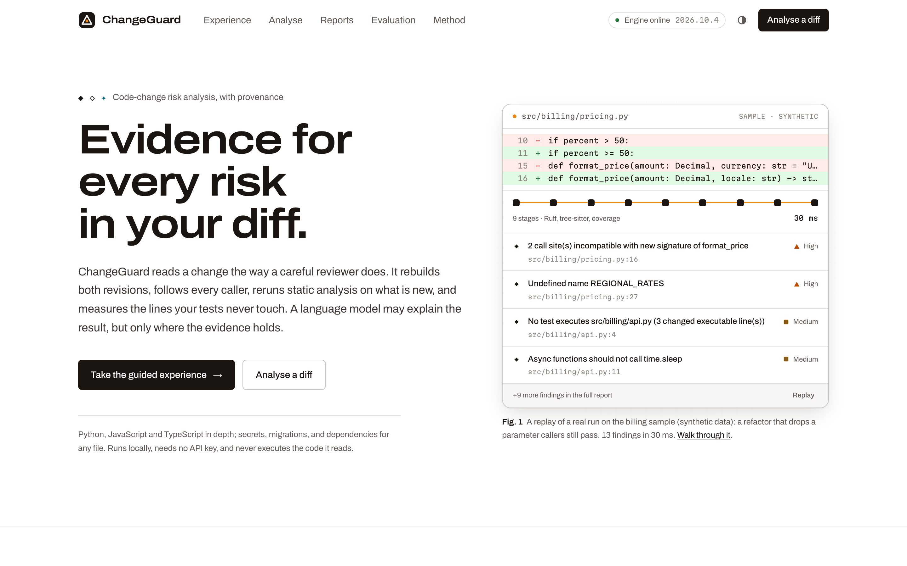
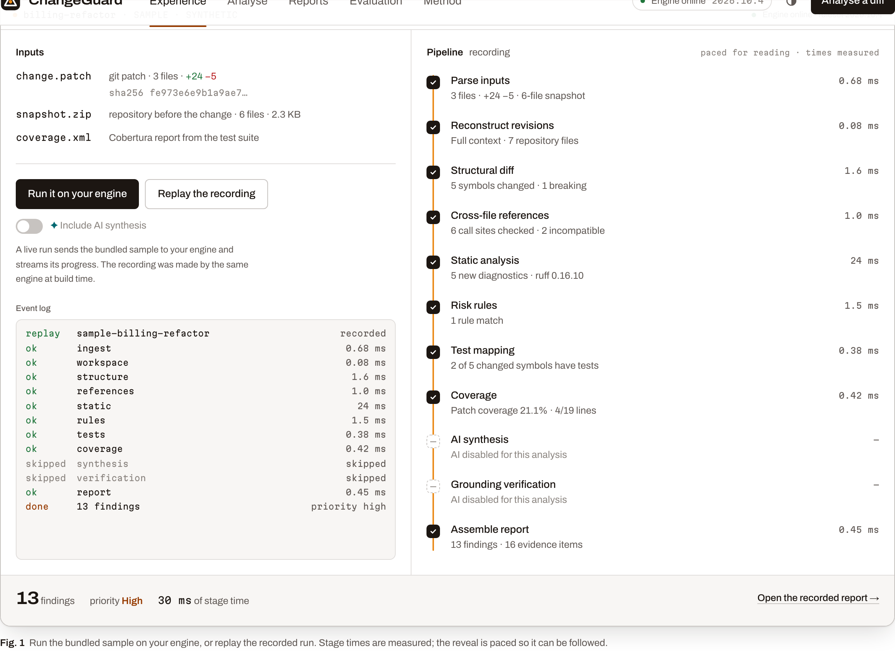
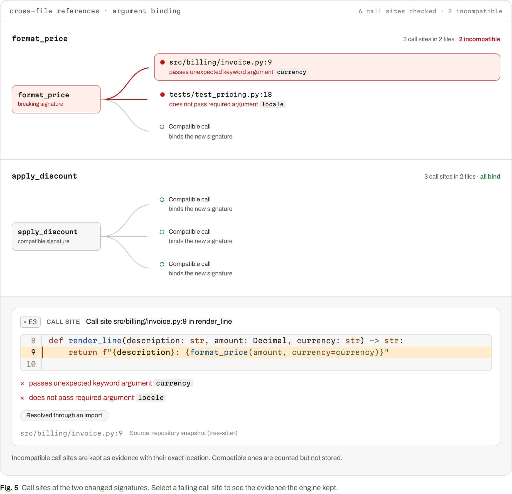
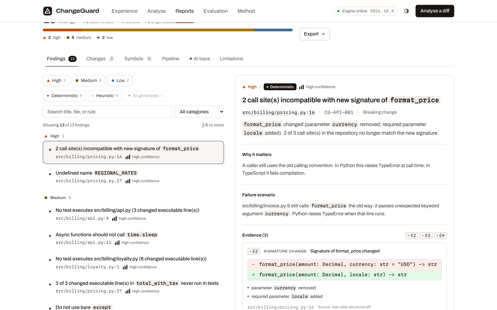
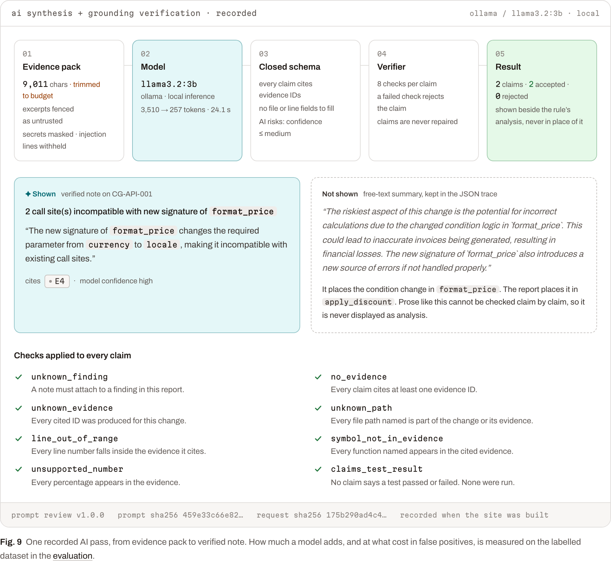
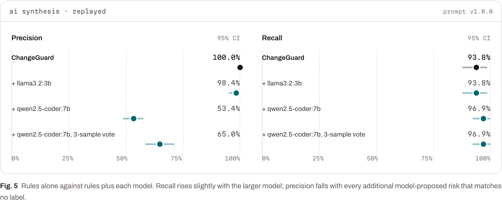
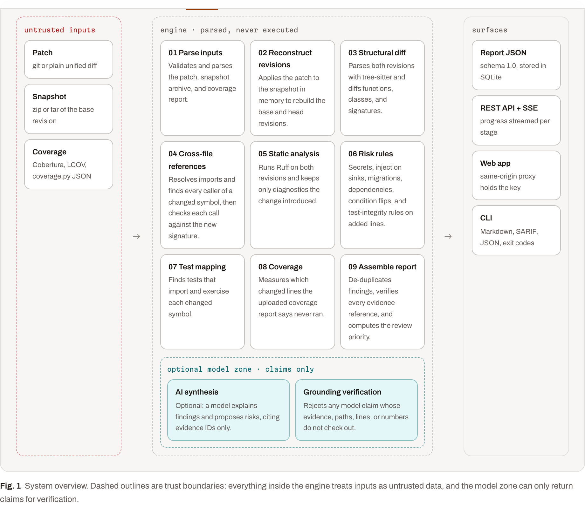
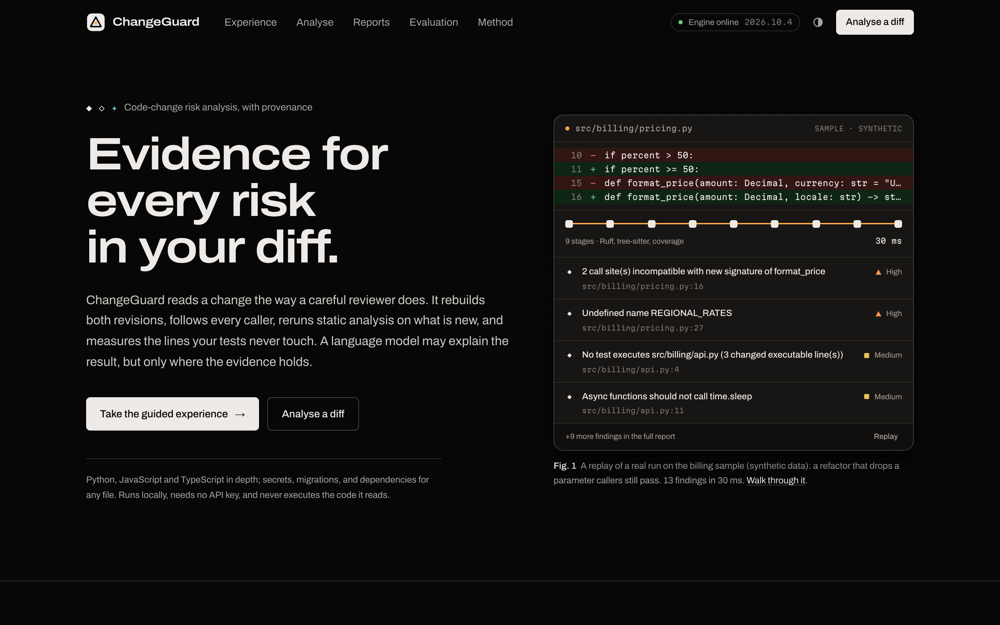

# ChangeGuard

[](https://github.com/ChethanKMurthy/changeguard/actions/workflows/ci.yml)

**Evidence for every risk in your diff.** ChangeGuard reads a code change the way
a careful reviewer does: it rebuilds both revisions, follows every caller,
reruns static analysis on what is new, and measures the changed lines your tests
never run. A language model may explain the result, but only where the evidence
holds.



## What makes it different

- **Every finding shows how it was established.** Each one is labelled
  deterministic (◆, a parse, a resolved call, a measured line), heuristic (◇, a
  rule's inference with stated confidence), or AI-generated (✦), and cites
  evidence by ID: exact lines, call sites, diagnostics, coverage hits.
- **Nothing is executed.** Archives are read in memory, Ruff reads source
  through stdin in isolated mode, git hooks are disabled, model output never
  triggers an action.
- **The model is held to the evidence.** It sees a fenced, redacted evidence
  pack and answers in a closed schema; a verifier rejects any claim whose
  evidence, paths, lines, symbols or numbers do not check out. Model findings
  are capped at medium confidence and never fail a build.
- **No invented probabilities.** Severity and confidence are categorical; review
  priority is a written rule, not a score.
- **Measured, including where it fails.** 67 labelled changes, clean holdout
  first runs, baselines, an ablation, bootstrap intervals, and three local
  models, with the misses and caveats published next to the numbers.

| | Precision | Recall | False alarms on safe changes |
|---|---|---|---|
| Rules, all 67 cases (optimistic: includes the dev split) | 100.0% [100–100] | 93.8% [88–99] | 0 of 9 |
| Rules, first run on holdout (21 cases) | 83.3% | 75.0% | 2 of 3 |
| Rules, first run on holdout-v2 (13 cases) | 100.0% | 81.8% | 0 of 2 |
| Rules without the repository snapshot (ablation) | 100.0% | 72.3% | 0 of 9 |

The dataset is small, synthetic, and written by the rules' author; these numbers
show agreement with a labelling guide, not real-world effectiveness. See
[docs/EVALUATION.md](docs/EVALUATION.md).

## Quick start

```bash
make setup && make dev          # engine on :8000, web app on :3000
# or
docker compose up --build       # same, in containers
```

Open http://localhost:3000, take the guided experience, or analyse a diff:

```bash
cd backend
uv run changeguard analyze --git-repo /path/to/repo --base origin/main --format markdown
uv run changeguard analyze --git-repo . --base origin/main --format sarif -o changeguard.sarif --fail-on high
```

Requirements: Python 3.12 with [uv](https://docs.astral.sh/uv/), Node.js 24. Local
AI is optional (Ollama). No API key or paid service is needed. Details:
[docs/SETUP.md](docs/SETUP.md).

## A tour

**Guided experience.** One change, followed stage by stage, with live figures.
Run the sample on your own engine and the finding IDs are checked against the
recording.





**Reports.** Findings by severity and provenance, evidence with exact lines, a
diff with inline markers, symbols, the pipeline trace, the AI trace, and exports
to Markdown, SARIF 2.1.0 and JSON.



**Verified AI.** What the model saw, what it was allowed to say, and what
survived verification.



**Evaluation and method.** Research-style results with intervals, and a system
card with the full rule catalogue and threat model.





Dark mode follows the system and can be toggled:



## How it works

Eleven stages, each reporting status, timing and a structured summary:
parse inputs → reconstruct revisions → structural diff (tree-sitter) → cross-file
references (argument binding) → static analysis (differential Ruff) → risk rules
→ test mapping → coverage → AI synthesis → grounding verification → report.
[docs/ARCHITECTURE.md](docs/ARCHITECTURE.md) has the diagram and module map.

```
backend/    Python engine: FastAPI, tree-sitter, Ruff, SQLite; CLI and evaluation harness
frontend/   Next.js 16 web app: guided experience, analysis workspace, reports, evaluation, method
eval/       labelled dataset, recorded model responses, baselines, reports, datasheet, labelling guide
docs/       architecture, API, setup, deployment, security, evaluation, limitations, system card
```

## Quality gates

| Check | Command | Status here |
|-------|---------|-------------|
| Engine tests (unit, API integration, data freshness) | `make test-engine` | 182 passing |
| Web unit and component tests | `make test-web` | 36 passing |
| End-to-end (Playwright, real engine, production build) | `make e2e` | 9 passing |
| Lint, format, types (Ruff, mypy strict, ESLint, tsc) | `make lint typecheck` | clean |
| Evaluation regression gate (replayed models) | `make eval-check` | no regressions |
| API contract drift (OpenAPI → TypeScript) | CI | in sync |
| Container builds | CI | defined; not built locally (no Docker daemon was available) |

[`.github/workflows/ci.yml`](.github/workflows/ci.yml) runs all of them.

## Deploy at zero cost

On AWS's Free plan, `deploy/aws/deploy.sh` brings up one EC2 instance behind
CloudFront and prints an HTTPS link; it checks the account plan first so it
cannot run up a bill without your say-so. Alternatives: Docker Compose on your
machine, or the engine on Render's free plan with the web app on Vercel Hobby
(`render.yaml` included). Public deployments give each browser its own workspace
and keep the engine key server-side.
[docs/DEPLOYMENT.md](docs/DEPLOYMENT.md) covers the trade-offs (free-tier
persistence, access control, hosted models).

## Documentation

| | |
|---|---|
| [Setup](docs/SETUP.md) | Install, run, configure, test |
| [Architecture](docs/ARCHITECTURE.md) | Pipeline, modules, AI boundary, web app, storage |
| [API](docs/API.md) | Endpoints, auth, workspaces, SSE events, errors |
| [Deployment](docs/DEPLOYMENT.md) | Compose, Render + Vercel, Hugging Face Spaces, operations |
| [Security](docs/SECURITY.md) | Threat model, headers, hardening checklist |
| [Evaluation](docs/EVALUATION.md) | Method and results, including misses and model comparison |
| [Limitations](docs/LIMITATIONS.md) | What it cannot do |
| [System card](docs/SYSTEM_CARD.md) | Intended use, model constraints, failure modes |
| [Case study](docs/CASE_STUDY.md) | Why it is built this way and what the evaluation taught |
| [Demo script](docs/DEMO_SCRIPT.md) | A seven-minute walkthrough |
| [Review](docs/REVIEW.md) | A skeptical review of this implementation |
| [Dataset](eval/DATASHEET.md) · [Labelling](eval/LABELING.md) | How the evaluation data was made |

## License

MIT. See [LICENSE](LICENSE).
