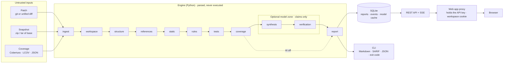

# Architecture

ChangeGuard is a modular monolith: one Python engine that does all analysis, a
Next.js web app that presents it, and a CLI that runs the same pipeline in CI.



## Request lifecycle

1. **Submit.** The browser posts a patch (and optionally a snapshot and a coverage
   report) to `/api/v1/analyses` on the web app's own origin. The Next.js route
   handler forwards it to the engine, adding the engine API key and the
   browser's workspace ID from an HttpOnly cookie.
2. **Prepare.** The engine validates sizes, parses the patch strictly, reads the
   archive in memory, and parses the coverage report (`ingest/`). Errors become
   RFC 9457 problem responses with stable codes.
3. **Queue.** The analysis row is stored with status `queued` and handed to a
   bounded worker pool (`api/jobs.py`). The client gets `202` with the ID.
4. **Run.** The pipeline (`analysis/pipeline.py`) executes eleven stages. Each
   stage records status, duration, and a structured summary; each transition is
   appended to `analysis_events`.
5. **Stream.** The browser follows `/analyses/{id}/events` (server-sent events,
   resumable with `Last-Event-ID`). If a proxy buffers SSE, the client falls back
   to polling the analysis resource.
6. **Report.** The final report (schema 1.0) is stored as JSON. Exports
   (Markdown, SARIF 2.1.0, JSON) are rendered from it on request.

## Pipeline stages

| # | Stage | Module | What it establishes |
|---|-------|--------|---------------------|
| 1 | Parse inputs | `ingest/` | Strict unified-diff parse, safe archive read, coverage parse |
| 2 | Reconstruct revisions | `analysis/workspace.py`, `ingest/patch_apply.py` | Base and head file contents, in memory |
| 3 | Structural diff | `analysis/structure.py`, `languages/` | Changed symbols, signatures, renames, complexity (tree-sitter) |
| 4 | Cross-file references | `analysis/references.py`, `analysis/api_contract.py` | Callers of changed symbols; each call bound against the new signature |
| 5 | Static analysis | `analysis/static_checks.py` | Ruff diagnostics new in head (stdin, `--isolated`) |
| 6 | Risk rules | `analysis/patterns.py`, `textual.py`, `dependencies.py`, `logic.py`, `metrics.py` | AST patterns, secrets, injection text, migrations, dependency changes, condition flips, test integrity |
| 7 | Test mapping | `analysis/tests_mapping.py` | Tests that import and reference each changed symbol |
| 8 | Coverage | `analysis/coverage_gaps.py` | Changed executable lines the report says never ran; staleness check |
| 9 | AI synthesis | `ai/synthesizer.py`, `ai/context.py` | Optional notes and proposed risks, citing evidence IDs |
| 10 | Grounding verification | `ai/grounding.py` | Rejects claims whose evidence, paths, lines, symbols, or numbers do not check out |
| 11 | Assemble report | `report/builder.py` | De-duplication, evidence pruning and checks, stable IDs, review priority |

Without a snapshot the pipeline runs in **diff-only** mode: hunks are parsed as
fragments, cross-file stages are skipped, and the report says so.

## Engine modules

```
backend/src/changeguard/
├── ingest/        diff_parser, patch_apply, archive (safe in-memory), coverage, prepare
├── languages/     tree-sitter indexers (Python, JavaScript, TypeScript, TSX): symbols, imports, calls
├── analysis/      the stages above, the evidence registry (context.py), the rule catalogue (rules/)
├── ai/            context pack, prompts (versioned), providers, schemas, grounding verifier, cache
├── report/        Pydantic report models, builder, exporters (Markdown, SARIF, JSON)
├── storage/       SQLite with forward-only migrations (PRAGMA user_version)
├── api/           FastAPI app, routes, auth, rate limiting, workspaces, job runner, SSE
├── evaluation/    dataset loader, matching, metrics + bootstrap, systems, evidence re-check, reports
├── samples/       the bundled, labelled synthetic sample
└── cli.py         `changeguard analyze | serve | samples | eval`
```

### Evidence and provenance

Every observation goes through an evidence registry (`analysis/context.py`)
that assigns IDs (`E1`, `E2`, …), redacts secrets, and de-duplicates. Findings
reference evidence by ID and carry a provenance (`deterministic`, `heuristic`,
`ai`), a categorical severity, and a categorical confidence. Finding IDs are
hashes of rule and location, so they are stable across runs; the guided
experience checks this live against the recorded sample.

### AI boundary

The model never sees raw input. `ai/context.py` builds a pack from the evidence
registry: excerpts are fenced as untrusted data with a per-request nonce,
secrets are already masked, and lines flagged as prompt injection are replaced
with a placeholder. The output schema (`ai/schemas.py`) is closed and has no
location fields. `ai/grounding.py` verifies every claim; rejected claims are
recorded with reasons. Accepted notes are attached beside findings; accepted
risks become `ai` findings capped at medium confidence. The free-text summary
is stored in the trace but never displayed. Provider calls are cached and,
for evaluation, recorded and replayed by request fingerprint.

## Web app

```
frontend/src/
├── app/                 routes: / · /experience · /analyze · /history · /reports/[id] · /reports/sample
│   │                    · /evaluation · /method, plus not-found and error boundaries
│   └── api/v1/[...path] same-origin proxy to the engine (streams bodies and SSE)
├── proxy.ts             issues the workspace cookie on first page view
├── components/          report views, experience figures, visualisations, primitives
├── data/                generated by the engine: recorded sample reports, rules, evaluation
└── lib/                 API client (typed from OpenAPI), SSE subscription, data hooks, formatting
```

- **Rendering.** Next.js 16 with Cache Components. Marketing, experience,
  evaluation, and method pages are static; their data is generated by the
  engine (`make data`, `make eval`) and committed, so they never show numbers
  typed in by hand. Report pages load live data on the client.
- **Contract.** The engine's OpenAPI document (`frontend/openapi.json`) generates
  the TypeScript types (`npm run gen:api`). CI fails if either drifts.
- **Security.** The browser only talks to the web app's origin. The proxy adds
  the engine key server-side, forwards only allow-listed headers, and sets the
  workspace from its own cookie, so clients cannot choose a workspace. Pages
  ship a same-origin Content Security Policy.

## Storage

One SQLite file (WAL mode) with three tables: `analyses` (metadata, options,
summary, report JSON, workspace), `analysis_events` (progress, for SSE replay),
and `llm_cache` (model responses by request fingerprint). Migrations are
forward-only and tracked with `PRAGMA user_version`. The store keeps the most
recent `CHANGEGUARD_MAX_STORED_ANALYSES` (500 by default).

## Design decisions

| Decision | Why |
|----------|-----|
| Monolith over services | One process to deploy on a free tier; stages share in-memory revisions. |
| tree-sitter over language servers | Fast, sandbox-free parsing of untrusted code; no project setup or execution. |
| Ruff via stdin, differential | Mature Python rules without running repository code or config; only new diagnostics. |
| Categorical severity and confidence | Honest about what the rules know; no invented probability. |
| AI as a verified, capped lane | Models add explanations and some recall; they cannot overrule or gate. |
| Record/replay for model evaluation | Reproducible numbers in CI without a model or a budget. |
| SQLite | Zero-ops persistence; the volume is the backup. |
